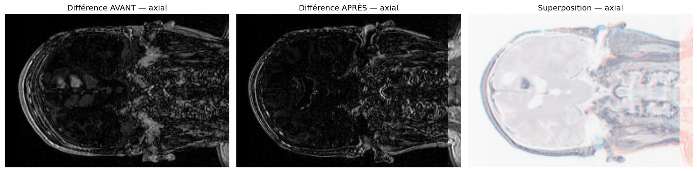
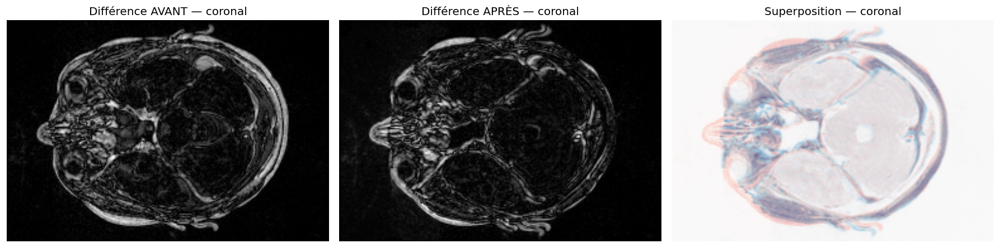
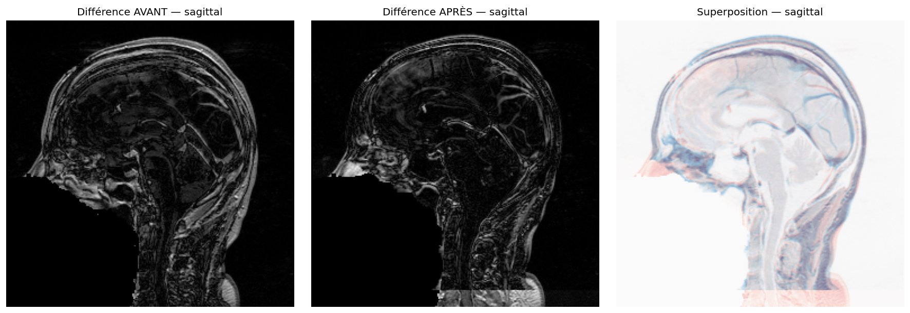
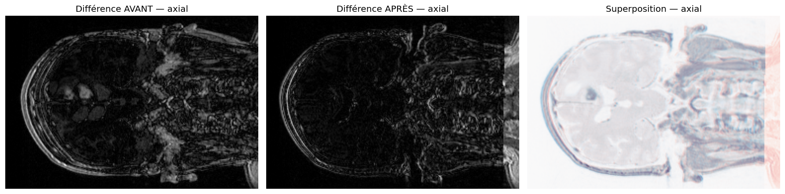
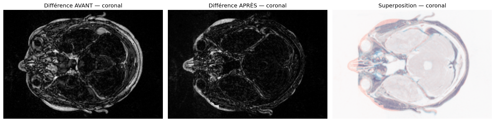
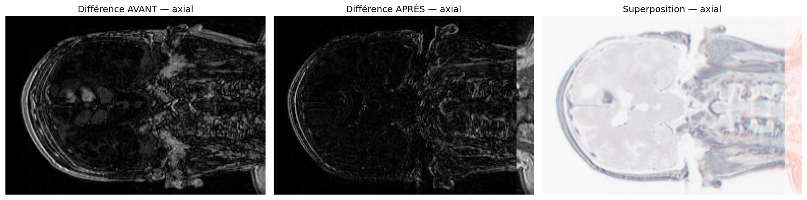
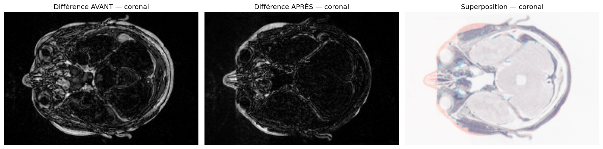
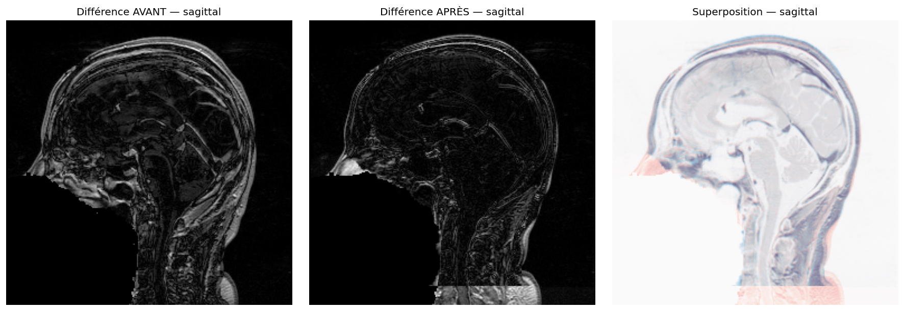
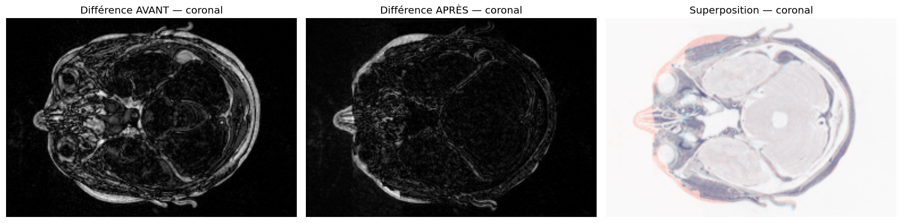

# Recalage des volumes — étude longitudinale de tumeur cérébrale

## Objectif

Suivre l'évolution d'une tumeur cérébrale à partir de deux acquisitions du même
patient prises à des dates différentes (« étude longitudinale »). Le recalage est
la première étape du pipeline : il aligne spatialement les deux volumes pour que
toute comparaison ultérieure — segmentation, image de différence, mesure de
volume — porte sur les mêmes positions anatomiques.

## Méthodes comparées

Quatre transformations, du moins au plus permissif, avec le **même flot
d'exécution** (même métrique, même optimiseur, mêmes hyperparamètres) pour que les
écarts viennent de la transformation et non de réglages incidents :

- **translation** (3 ddl) — `TranslationTransform`, sans initialisation de centre ;
- **rigide** (6 ddl : 3 rotations + 3 translations) — `VersorRigid3DTransform`
  (versor → pas de gimbal lock) ;
- **similarity** (7 ddl : rigide + échelle isotrope) — `Similarity3DTransform` ;
- **affine** (12 ddl : + échelle anisotrope + cisaillement) — `AffineTransform`.

Configuration commune : métrique `MeanSquaresImageToImageMetricv4` (IRM ↔ IRM),
optimiseur `RegularStepGradientDescentOptimizerv4` (LR 4.0, pas min 1e-4, relaxation
0.5, 200 itérations), normalisation des pas par
`RegistrationParameterScalesFromPhysicalShift`, et initialisation sur le centre
géométrique du volume fixe.

## Métrique de comparaison

On agrège l'image de différence en un scalaire : la **RMS du résidu** sur tout le
volume, `sqrt(mean((fixe − recalé)²))` — exactement ce que les coupes « différence »
montrent à l'œil, condensé en un nombre. Le « gain » est sa réduction relative par
rapport à l'état avant recalage.

Limite essentielle : cette RMS est **globale**. Elle additionne le désalignement
géométrique (qu'on veut annuler) et le changement réel de la tumeur (qu'on veut
préserver). Une RMS plus basse ne dit donc pas, seule, si la baisse vient d'un
meilleur alignement ou d'une transformation qui absorbe le vrai changement.

## Résultats

| Méthode      | ddl | Résidu APRÈS | Gain   | Incrément vs précédent |
|--------------|----:|-------------:|-------:|-----------------------:|
| *(avant)*    |  —  |       179.16 |   —    |          —             |
| translation  |  3  |       125.53 | 29.9 % |        +29.9 pt        |
| rigide       |  6  |       118.91 | 33.6 % |         +3.7 pt        |
| similarity   |  7  |       116.86 | 34.8 % |         +1.2 pt        |
| affine       | 12  |       112.98 | 36.9 % |         +2.1 pt        |

## Analyse

**Le classement global est trompeur par construction.** Le résidu décroît de façon
monotone avec le nombre de degrés de liberté : c'est mécanique, plus de paramètres
ne peuvent que mieux ajuster un critère aux moindres carrés. Que l'affine arrive en
tête n'est donc *pas* une raison de le choisir — c'est ce qu'on observerait même si
l'affine était le mauvais outil.

**Ce sont les incréments qui parlent.** L'essentiel du résidu géométriquement
récupérable l'est par la translation puis surtout par les rotations : passer de la
translation au rigide rapporte **+3.7 pt**, le plus gros saut. C'est cohérent avec
la physique du problème — entre deux acquisitions d'un même patient, la tête diffère
seulement par sa position et son orientation dans la machine. Au-delà du rigide, les
ddl supplémentaires ne rapportent presque rien (**+1.2 pt** pour l'échelle isotrope,
**+2.1 pt** pour l'échelle anisotrope et le cisaillement) — et ces gains sont les
plus suspects, car sur un crâne indéformable il n'existe aucune différence réelle
d'échelle ou de cisaillement à corriger.

**Analyse qualitative des coupes.** La colonne AVANT montre des liserés clairs le
long de la voûte crânienne et des structures médianes (contours fantômes du
désalignement), sur un fond gris diffus dû aux différences d'intensité IRM. Dès le
**rigide**, ces contours s'éteignent largement et la superposition vire au neutre
sur l'essentiel du parenchyme : l'anatomie est correctement réalignée dans les trois
plans. La **translation** seule laisse au contraire des franges nettes (rotation non
corrigée). **Similarity et affine sont visuellement indiscernables du rigide** :
aucune région n'apparaît mieux alignée, donc le gain de RMS de l'affine ne se traduit
par aucune amélioration géométrique visible — ce qui appuie l'hypothèse qu'il provient
de l'ajustement des intensités, non de la géométrie.

**Choix retenu : le recalage rigide.** Il capte la quasi-totalité du résidu
géométriquement légitime et s'arrête là où les ddl supplémentaires cesseraient de
corriger une différence de pose pour commencer à fabriquer une déformation sans
réalité anatomique. C'est le meilleur compromis entre alignement et préservation du
signal à mesurer.

## Limites et pistes

- **La métrique globale ne tranche pas affine vs rigide.** Le test propre est la RMS
  scindée dans / hors d'une ROI tumeur : un bon rigide fait chuter la RMS hors tumeur
  tout en laissant la RMS dans la tumeur élevée (changement préservé) ; si l'affine
  fait aussi baisser la RMS dans la tumeur, c'est la preuve chiffrée qu'il absorbe le
  signal. Cette ROI viendra de l'étape de segmentation.
- **MeanSquares est sensible aux différences d'intensité IRM** ; une métrique robuste
  (`MattesMutualInformation`, `Correlation`) séparerait mieux erreur géométrique et
  erreur d'intensité.
- **L'analyse par coupe ne porte que sur une coupe médiane par plan** : un défaut
  d'alignement ailleurs dans le volume peut échapper à l'œil. Le qualitatif accompagne
  le chiffré, il ne le remplace pas.

## Figures

Pour chaque méthode et chaque plan : différence AVANT recalage, différence APRÈS, et
superposition (fixe en rouge, recalé en bleu). Le recalage est satisfaisant lorsque
l'image APRÈS est nettement plus sombre que AVANT.

### Translation (3 ddl)

### Rigide (6 ddl) — méthode retenue

### Similarity (7 ddl)

### Affine (12 ddl)

## Focus tumeur (coupe axiale)

La coupe axiale traverse la zone tumorale (région claire d'un hémisphère sur la
différence AVANT). En comparant rigide et affine sur ce plan : le résidu tumoral
reste comparable, l'affine ne nettoie aucune structure de plus. Indice visuel — non
une preuve — que son gain de RMS ne tient pas à un meilleur alignement. La
confirmation passera par la RMS dans / hors ROI après segmentation.

