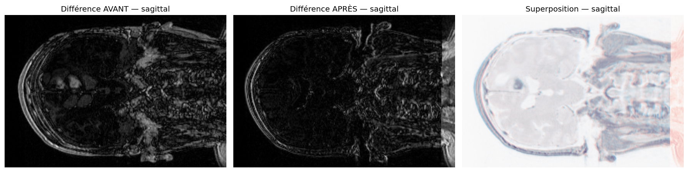

# Recalage des volumes — étude longitudinale de tumeur cérébrale

## Objectif

Suivre l'évolution d'une tumeur cérébrale à partir de deux CT scans du même
patient acquis à des dates différentes. Le recalage est la première étape du
pipeline : il aligne spatialement les deux volumes pour que toute comparaison
ultérieure (segmentation, image de différence, mesure de volume) porte sur les
mêmes positions anatomiques.

## Choix : recalage rigide

J'ai retenu un **recalage rigide** (6 degrés de liberté : 3 rotations +
3 translations), avec :

- transform : `VersorRigid3DTransform` (versor → pas de gimbal lock, meilleur
  comportement à l'optimisation que les angles d'Euler) ;
- métrique : `MeanSquaresImageToImageMetricv4` (les deux scans sont en même
  modalité, CT ↔ CT) ;
- optimiseur : `RegularStepGradientDescentOptimizerv4` ;
- initialisation : `CenteredTransformInitializer` (centres géométriques) ;
- normalisation des pas : `RegistrationParameterScalesFromPhysicalShift`
  (équilibre automatiquement rotation et translation).

## Justification

**Le rigide préserve le signal que l'on cherche à mesurer.** Un recalage
déformable (non-rigide) cherche à faire correspondre les deux volumes point à
point ; il absorberait la croissance ou la régression de la tumeur dans son
champ de déformation, effaçant précisément le changement à quantifier. Le rigide
aligne globalement l'anatomie sans rien déformer localement : ce qui a évolué
entre les deux dates reste visible.

**Le cerveau est un cas idéal pour le rigide.** La boîte crânienne est un solide
indéformable. Pour un même patient, deux acquisitions ne diffèrent que par la
position de la tête dans la machine — translations et rotations, rien d'autre.
Ces 6 degrés de liberté suffisent donc à un alignement quasi exact.

**Pourquoi pas l'affine ?** L'affine (12 ddl) ajoute mise à l'échelle et
cisaillement, utiles pour corriger des différences de calibration entre
machines. Mais ici les deux scans viennent du même patient sur des acquisitions
comparables : l'affine apporterait peu et commencerait déjà à compenser une
partie du changement réel. Le rigide est le bon compromis.

## Résultats

Pour chaque plan orthogonal, trois vues : différence AVANT recalage, différence
APRÈS recalage, et superposition (volume fixe en rouge, volume recalé en bleu).
Le recalage est satisfaisant lorsque l'image de différence « APRÈS » est
nettement plus sombre que « AVANT » : les contours fantômes liés au
désalignement disparaissent, et seul subsiste le changement réel de la tumeur.

### Coupe axiale

### Coupe coronale

### Coupe sagittale

